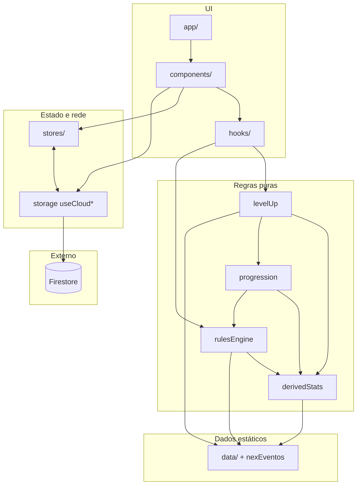

# codebase.md — H.I.I-C.R.I.S

> **H.I.I** — Heuristic Information Interface · **C.R.I.S.** — Central de Reconhecimento de Irregularidades Sobrenaturais  
> **Last updated**: 2026-03-19 (**r6** — otimização para agentes: briefing denso, menos duplicação, `Personagem` por referência ao código)

**Propósito:** mapa de **implementação** (não substitui `docs/` livro nem `src/` linha a linha). **Manter:** mudança estrutural → atualizar este ficheiro + linha em `Last updated`.

---

## 0. AGENT BRIEFING — ler primeiro

| | |
|---|---|
| **Stack** | Next 15 · React 18 · TS 5.4 · Firebase 12 · Zustand 5 · Tailwind 3 |
| **Aliases** | `@/` → `./src` |
| **Regras de código** | `docs/AGENT_RULES.md` — **sem comentários** no fonte |
| **Regras de jogo (livro)** | `docs/` + MCP que já usas |
| **Roadmap refatoração** | `docs/implementation_plan.md` |

### MUST / NEVER (invariantes)

| ID | Regra |
|----|--------|
| M1 | `Personagem` é o modelo único; atualizações **imutáveis** (nunca mutar in-place). |
| M2 | Fórmulas PV/PE/SAN/PD/Defesa **só** em `calculateDerivedStats()` → `src/core/rules/derivedStats.ts`. |
| M3 | Marcos NEX **só** em `NEX_EVENTOS` → `src/core/rules/nexEventos.ts` (import em `levelUp` / `rulesEngine`). |
| M4 | Bônus de origem: sincronizar **`calcularBonusOrigem`** (`derivedStats`) e **`calcularBonusPoderOrigem`** (`rulesEngine`). |
| M5 | **Sobrevivente**: `estagio` 1–4, limite atributos, PD — grep `Sobrevivente` antes de mudar progressão. |
| M6 | Componentes com hooks/state → `"use client"`. Cores: paleta `ordem-*` em Tailwind, sem hex solto. |
| M7 | Escrita Firestore → **`removeUndefinedFields()`** antes de persistir. |
| M8 | Pools PV/PE/SAN na edição → **`calcularRecursosClasse`** em `src/logic/progression.ts`, não duplicar em `rulesEngine`. |

### Task → ficheiro (decisão rápida)

| Tarefa | Onde |
|--------|------|
| Novo campo / tipo | `src/core/types.ts` |
| Cálculo de atributo de regra | `src/core/rules/derivedStats.ts` |
| Criação de ficha | `gerarFicha` · `src/logic/rulesEngine.ts` + wizard `creationWorkflow.ts` |
| Subir / rebaixar NEX, pendências | `src/logic/levelUp.ts` |
| Editar ficha existente, recalc | `src/logic/progression.ts` (`recalcularRecursosPersonagem`) |
| Tabela NEX % | `src/core/rules/nexEventos.ts` |
| Catálogo estático | `src/data/character|combat|equipment|magic|reference/` |
| Sync cloud | `userDataService.ts` + novo `useCloud*` em `src/core/storage/` |
| Tab mestre | `MasterDashboard.tsx` · `MestreNavbar.tsx` |
| Combate / level-up UI state | `src/hooks/useCombatManager.ts` · `useLevelUpFlow.ts` |
| Termos PT (domínio) | §16 |
| MCP vs código | Livro = `docs`/MCP · App = aqui + `src/` |

### Entrypoints `logic/` (memória de trabalho)

`gerarFicha` · `subirNex` / `rebaixarNex` / `resolverPendencia` · `recalcularRecursosPersonagem` · `calculateDerivedStats` · exports completos → **§5A**.

### Imports típicos

`@/core/types` · `@/logic/rulesEngine` · `@/logic/levelUp` · `@/logic/progression` · `@/core/storage` · `@/components/ui` · `@/lib/utils` (`cn`)

### rg (copy-paste)

```text
rg "Sobrevivente" src/logic src/core/rules
rg "calculateDerivedStats" src/
rg "NEX_EVENTOS" src/
rg "removeUndefinedFields" src/core/firebase
```

**Grafos de camadas:** Mermaid em **§2**. **Não importar** `components/` ou `app/` de dentro de `logic/`.

**Ordem de leitura (eficiência):** §0 → tabela **Task → ficheiro** → **§5A** → §4 + `src/core/types.ts` se precisar de campos · §6/§7/§14 só se Firebase/sync/risco forem relevantes.

### Índice (§1–§18)

Visão geral · Arquitetura · Pastas · `Personagem` (resumo) · Módulos + **§5A API** · Fluxos · Firebase · Stores · UI · Env · Dev/Runbook/Testes · Convenções · **Anti-patterns** · Recipes · Riscos · Dívida · Glossário · RAG/MCP · ADR-lite.

---

## 1. Project Overview

**H.I.I-C.R.I.S** is a web application that serves as a **Game Master management tool** for the Brazilian TTRPG **Ordem Paranormal**. It provides:

- **Character sheet creation** (`Fichas`) with rule-compliant stat calculation
- **Level-up progression** with automatic event detection and pending choice management
- **Combat management** with initiative tracking, combatant cards, conditions, dice rolling
- **Monster/Threat management** (`Ameaças`) — import from rulebook or create custom
- **NPC management** with full stat blocks
- **Campaign organization** (`Campanhas`) — group character sheets
- **Item & Weapon management** with weapon modifications system
- **Rules reference guide** (`Guia do Mestre`)
- **Cloud sync** — Firebase Firestore per authenticated user
- **Real-time agent viewing** — GM watches player character sheets

### Main Technologies

| Technology | Version | Purpose |
|---|---|---|
| **Next.js** | 15.5.x | App Router, SSR, file-based routing |
| **React** | 18.3.x | UI rendering |
| **TypeScript** | 5.4.x | Type safety |
| **Firebase** | 12.6.x | Auth (Google), Firestore (database) |
| **Zustand** | 5.0.x | Client-side state management |
| **TailwindCSS** | 3.4.x | Styling |
| **Framer Motion** | 12.25.x | Animations |
| **Radix UI** | Various | Accessible dialog, tabs, tooltip primitives |
| **dnd-kit** | 6.3.x / 10.x | Drag-and-drop (sortable lists) |
| **Lucide React** | 0.555.x | Icon system |

---

## 2. Architecture Overview

Monólito Next.js: `app` → `components` + `hooks` → `logic` + `stores` + `storage` → `core` + `data` → Firestore.

Fluxo de dados (runtime) — mudanças em `Personagem`:



---

## 3. Directory Structure

```
src/
  app/          (main)/ · agente/novo|recriar · ficha/[id] · mestre/fichas/[id]
  components/   master/ · ui/ · creation/ · *.tsx raiz
  core/         types · personagemUtils · firebase/* · rules/* · storage/* · validation/
  data/         character/ · combat/ · equipment/ · magic/ · reference/
  logic/      rulesEngine · levelUp · progression · creationWorkflow · combatUtils · diceRoller · …
  hooks/      useCombatManager · useLevelUpFlow
  stores/     fichas · UI · threats
  lib/        utils · motion
docs/  scripts/  mcps/  public/  firestore.rules  tailwind.config.ts  next.config.ts  package.json
```

---

## 4. The `Personagem` Type — Central Data Model

**Fonte canónica:** `interface Personagem` em `src/core/types.ts` (ler o ficheiro para campos exatos).

**Grupos de campos:** identidade (`nome`, `classe`, `origem`, `nex` | `estagio`, `patente`, `trilha`, `afinidade`) · `atributos` · `pericias` + `periciasDetalhadas` · pools `pv`/`pe`/`san`/`pd?` · derivados `defesa`, `deslocamento`, `carga`, `limiteItens` · coleções `equipamentos`, `poderes`, `rituais`, `efeitosAtivos`, `eventosNex` · pendências NEX (`pendenciasNex`, pontos/atributo/perícia/poder/trilha) · `overrides?` · transcendência (`qtdTranscender`, `usarPd`, `bonus`, `log`).

**Catálogos:** classe → `data/character/classes` · origem → `origins` · trilha → `tracks` · poderes → `powers` · rituais → `magic/rituals` · itens/arma → `equipment/items`, `combat/weapons` · cores ritual → `magic/elementColors`.

---

## 5. Core Modules — Detailed Reference

### 5.1 Rules Engine (`src/logic/rulesEngine.ts`)

`CriacaoInput` → **`gerarFicha()`** → `Personagem`. Inclui perícias, carga, patente, `listarEventosNex` (dados de `nexEventos.ts`). **`calcularRecursosClasse` → progression.**

`gerarFicha` ordem resumida: validar atributos → patente → perícias (origem, obrigatórias, livres) → trilha → bônus origem → `calculateDerivedStats` → `periciasDetalhadas` → eventos NEX → efeitos ativos.

### 5.2 Level-Up (`src/logic/levelUp.ts`)

Importa **`NEX_EVENTOS`** (`nexEventos.ts`) e **`calcularRecursosClasse`** (`progression`). Núcleo: **`subirNex` / `rebaixarNex`** (simetria obrigatória), **`resolverPendencia`**, utilitários de pendências e eventos — ver **§5A**.

**Marcos NEX:** única tabela em `src/core/rules/nexEventos.ts` (não duplicar aqui → evita drift).

### 5.3 Derived Stats Calculator (`src/core/rules/derivedStats.ts`)

**THE single source of truth for stat formulas.**

```
PV = pvInicial + VIG + (growthSteps × (pvPorNivel + VIG)) + originBonus + trackBonus
PE = peInicial + PRE + (growthSteps × (pePorNivel + PRE)) + originBonus
SAN = sanInicial + (growthSteps × sanPorNivel) + originBonus − (transcendCount × sanPorNivel)
Defesa = 10 + AGI + originBonus + trackBonus
PE/rodada = nivel (1-20)
growthSteps = nivel − 1
nivel = ceil(NEX / 5), clamped 1-20
```

Sobrevivente exception:
```
PV = 8 + VIG + (estagioGrowth × 2) + bonuses
PE = 2 + PRE + (estagioGrowth × 1)
PE/rodada = 1 (always)
estagioGrowth = estagio − 1
```

### 5.4 Progression (`src/logic/progression.ts`)

Edição unitária de personagem já existente + cálculo de pools por classe:

- `calcularRecursosClasse(params)` — PV/PE/SAN/PD/limite PE rodada (via `calculateDerivedStats`)
- `applyAttributePoint()` / `removeAttributePoint()` — ponto de atributo; INT concede vaga de perícia pendente
- `chooseTrack()` — trilha + habilidades da trilha até NEX/estágio atual
- `choosePower()` — valida `PODERES`, requisitos, adiciona poder
- `recalcularRecursosPersonagem()` — recálculo público após mudanças
- `recalculateStats()` (internal) — PV/PE/SAN/defesa/carga/perícias detalhadas + overrides

Importa `calcularPericiasDetalhadas` e `calcularCarga` de `rulesEngine.ts` (sem ciclo: `rulesEngine` não importa `progression`).

### 5.5 Creation Workflow (`src/logic/creationWorkflow.ts` — 184 lines)

State machine for the character creation wizard:

```
Step 0: setTipo('Agente' | 'Sobrevivente')
Step 1: setConceitoClasse(nome, conceito, classe, nex, estagio)
Step 2: setAtributos(atributos) — validates distribution
Step 3: setOrigem(origemNome)
Step 4: setPericias(periciasEscolhidas)
Step 5: setRituais(rituais) — Ocultista only
Step 6: setEquipamento(equipamentos)
Step 7: finalizarCriacao() → Personagem
```

`finalizarCriacao()` calls `gerarFicha()` at NEX 5 (or Estágio 1), then immediately calls `subirNex()` to the target NEX.

### 5.6 Class Stats Reference (`src/data/character/classes.ts`)

| Class | PV Init | PV/Lvl | PE Init | PE/Lvl | SAN Init | SAN/Lvl | Skills | Mandatory |
|---|---|---|---|---|---|---|---|---|
| **Combatente** | 20 | +4 | 2 | +2 | 12 | +3 | 1+INT | Luta/Pontaria, Fortitude/Reflexos |
| **Especialista** | 16 | +3 | 3 | +3 | 16 | +4 | 7+INT | None |
| **Ocultista** | 12 | +2 | 4 | +4 | 20 | +5 | 3+INT | Ocultismo, Vontade |
| **Sobrevivente** | 8 | +2 | 2 | +1 | 8 | +2 | 1+INT | None |

### 5.7 Attribute Rules (`src/core/rules/attributes.ts`)

- Initial base: all 5 attributes start at 1 (total = 5)
- Agents get 4 bonus points → target sum = 9
- Sobrevivente gets 3 bonus points → target sum = 8
- Maximum per attribute at creation: 3
- Only 1 attribute may be reduced to 0

### 5A. Public API — src/logic/ (main modules)

Referência **curata** do que a UI e `core/` costumam importar. Não lista `combatUtils`, `creationWorkflow`, etc.; ver ficheiros para lista completa.

| Módulo | Símbolo | Papel |
|--------|---------|--------|
| `rulesEngine.ts` | `gerarFicha`, `CriacaoInput` | Criação de `Personagem` |
| | `getPatentePorNex`, `getPatenteConfig`, `listarPatentes` | Patente e limites |
| | `calcularPericiasDisponiveis`, `calcularPericiasDetalhadas` | Perícias (slots e rolagem) |
| | `calcularCarga` | Carga |
| | `listarEventosNex` | Marcos de NEX já atingidos (dados de `nexEventos.ts`) |
| | `calcularDTRitual` | DT de ritual |
| | `TODAS_PERICIAS`, `PERICIA_ATRIBUTO`, `TODAS_PATENTES` | Constantes / mapas |
| | `ClassePreferencias` | Preferências de classe na UI |
| | `calcularBonusPoderOrigem`, `criarBonusOrigemVazio` | Bônus de origem (sincronizar com `derivedStats`) |
| `levelUp.ts` | `subirNex`, `rebaixarNex` | Fluxo de NEX |
| | `resolverPendencia`, `getPendenciasNaoResolvidas`, `temPendencias` | Pendências |
| | `calcularEventosDesbloqueados`, `detectingPendenciesAndAutoApply` | Eventos e auto-aplicação |
| | `calcularRecursosParaNex`, `nexParaNivel`, `criarPendenciaTranscender` | Utilitários de progressão |
| | `LevelUpResult`, `MudancasNex` | Tipos de resultado |
| `progression.ts` | `calcularRecursosClasse` | Pools PV/PE/SAN/PD/PE rodada |
| | `applyAttributePoint`, `removeAttributePoint` | Atributos |
| | `chooseTrack`, `choosePower` | Trilha e poder de classe |
| | `recalcularRecursosPersonagem` | Recalcular ficha após edição |

**Contrato:** funções em `logic/` devem permanecer **puras** (sem `fetch`, sem Firestore, sem hooks). Efeitos colaterais ficam em componentes, `stores/` ou `storage/`.

---

## 6. Data Flow Diagrams

### Character Creation

```
CharacterCreator.tsx (wizard UI)
  → creationWorkflow.ts (state machine: steps 0-7)
    → characterUtils.ts (validation helpers)
    → rulesEngine.ts → gerarFicha() (creates Personagem at base NEX)
    → levelUp.ts → subirNex() (advances to target NEX)
  → useFichasStore.addFicha()
  → useCloudFichas → saveFichaToCloud()
  → Firebase Firestore
```

### Level-Up

```
LevelUpModal.tsx (+ `useLevelUpFlow` em `src/hooks/useLevelUpFlow.ts`)
  → levelUp.subirNex(personagem, novoNex)
    → calcularRecursosParaNex() (delta calculation)
    → calcularEventosDesbloqueados() (what unlocked)
    → detectingPendenciesAndAutoApply()
    → Returns { personagem, mudancas, pendenciasNovas }
  → PendingChoiceModal.tsx (user resolves each PendenciaNex)
    → levelUp.resolverPendencia()
  → useFichasStore.updateFicha()
  → Cloud sync
```

### Master Dashboard Tab Architecture

```
MasterDashboard.tsx (tab orchestrator)
  ├── MestreNavbar.tsx (tab navigation: 6 tabs)
  ├── Tab 'fichas'     → FichasManager.tsx (→ AgentList → AgentDetailView)
  ├── Tab 'ameacas'    → MonsterList.tsx (→ MonsterEditor)
  ├── Tab 'combate'    → CombatManager.tsx + `useCombatManager` (`src/hooks/useCombatManager.ts`)
  ├── Tab 'inventario' → ItemManager.tsx (→ ItemSelectorModal, WeaponModsModal)
  ├── Tab 'guia'       → GuiaMestre.tsx
  └── Tab 'npcs'       → NpcList.tsx (→ NpcEditor)
```

### State Sync Architecture

```
┌────────────────┐     Zustand persist    ┌──────────────┐
│ useFichasStore │ ←──── localStorage ────→│ Browser      │
│ useThreatsStore│                        │ (offline)    │
└────────┬───────┘                        └──────────────┘
         │ read/write
┌────────┴───────┐     onSnapshot()       ┌──────────────┐
│ useCloud*      │ ←──── real-time ───────→│ Firebase     │
│ (storage hooks)│       listener          │ Firestore    │
└────────────────┘                        └──────────────┘
```

---

## 7. Firebase & Firestore Schema

### Authentication

- Provider: Google Sign-In (`signInWithPopup`)
- Persistence: `browserLocalPersistence`
- Context: `AuthProvider` in `src/core/firebase/auth.ts`
- Hooks: `useAuth()`, `useAuthOptional()`

### Firestore Collections

```
agentes/{agentId}                           # Public agent documents
  └── Personagem + { ownerId, updatedAt }   # Read: anyone. Write: authenticated.

users/{userId}/
  ├── fichas/{fichaId}                      # Private character sheets
  │   └── { id, personagem: Personagem, atualizadoEm, campanha? }
  ├── campanhas/{campanhaId}                # Campaigns
  │   └── { id, nome, cor?, ordem }
  ├── monstros/{monstroId}                  # Custom monsters
  │   └── { id, ameaca: Ameaca, atualizadoEm }
  ├── npcs/{npcId}                          # NPCs
  │   └── { id, npc: NPC, atualizadoEm }
  ├── customData/items                      # Custom items (single doc)
  │   └── { items: Item[], weapons: Weapow[] }
  └── watchedFichas/{agentId}               # GM watching player sheets
      └── { id, agentId, nome, classe, nex, adicionadoEm }
```

### Security Rules Summary

| Path | Read | Write |
|---|---|---|
| `agentes/*` | **Anyone** | Authenticated |
| `users/{userId}/**` | Owner only | Owner only |
| Everything else | Denied | Denied |

---

## 8. Zustand Stores

| Store | Persistência | Estado (resumo) |
|-------|----------------|-----------------|
| `useFichasStore` | `fichas-store` | `fichas[]` (`FichaRegistro` + `Personagem`), `campanhas[]`, `fichaAtiva`, `campanhaAtiva`; `addFicha` / `updateFicha` / … |
| `useUIStore` | — | sidebar, `activeModal`, tema, scanline, mobile, loading; `useModal`, `useSidebar` |
| `useThreatsStore` | `user-threats-store` | `threats: Ameaca[]` |

---

## 9. UI Component Library (`src/components/ui/`)

| Component | Exports | Based on |
|---|---|---|
| `Button.tsx` | `Button`, `IconButton` | Custom (variants: `primary`, `danger`, `ghost`, etc.) |
| `Card.tsx` | `Card`, `CardHeader`, `CardContent`, `CardFooter`, `CardTitle`, `CardDescription` | Custom |
| `Modal.tsx` | `Modal`, `ModalContent`, `ModalHeader`, `ModalBody`, `ModalFooter`, etc. | Radix Dialog |
| `Tabs.tsx` | `Tabs`, `TabsList`, `TabsTrigger`, `TabsContent` | Radix Tabs |
| `Tooltip.tsx` | `Tooltip`, `RichTooltip` | Radix Tooltip |
| `Input.tsx` | `Input`, `Textarea` | Custom |
| `Badge.tsx` | `Badge`, `DotBadge` | Custom |
| `Collapsible.tsx` | `Collapsible`, `ControlledCollapsible` | Custom |
| `Skeleton.tsx` | `Skeleton`, `SkeletonText`, `SkeletonCard`, `SkeletonStatusBar`, `SkeletonAvatar` | Custom |

All use `cn()` from `@/lib/utils` for class merging.

---

## 10. Environment & Configuration

### `.env.local`

| Variable | Purpose |
|---|---|
| `NEXT_PUBLIC_FIREBASE_*` (7 vars) | Firebase project configuration |
| `NEXT_PUBLIC_MASTER_PASSWORD` | Simple string gate for `/mestre` routes (client-visible) |

### Key Config Files

| File | Key settings |
|---|---|
| `next.config.ts` | `reactStrictMode: true`, `typedRoutes: true` |
| `tailwind.config.ts` | Custom `ordem.*` colors, `pulse-red`/`flicker`/`glitch` animations, Courier New font |
| `tsconfig.json` | `@/` → `./src`, strict mode, `jsx: preserve` |

**Cores:** tokens `ordem-*` (e animações `pulse-red`, etc.) em `tailwind.config.ts` — não hardcodar hex nos componentes.

---

## 11. Development Workflow

```bash
npm install          # Install dependencies
npm run dev          # Dev server at http://localhost:3000
npm run build        # Production build
npm run lint         # ESLint
npm run strip-code-comments  # Remove comentários // e /**/ em src/ (ver scripts/strip-code-comments.mjs)
```

**No automated tests exist.** Verification is manual.

### Runbook (problemas frequentes)

| Sintoma | Causa provável | Ação |
|---------|----------------|------|
| Build falha em types | `Personagem` ou imports `@/` | `npm run build`; ver erros em `src/core/types.ts` e paths em `tsconfig` |
| Firestore rejeita doc | Campos `undefined` | Garantir `removeUndefinedFields()` antes do `setDoc`/`updateDoc` |
| Stats errados após editar regra | Só mexeu em `derivedStats` ou só em `rulesEngine` | Origens: §14 + **M4**; NEX: `nexEventos.ts` + `levelUp` |
| Sync estranho | Dupla persistência | `useFichasStore` + `useCloudFichas`; sem merge automático (§14) |

### Roadmap de testes (estado da arte para este repo)

Hoje: **0 testes**. Próximo passo recomendável (ordem):

1. **`derivedStats.test.ts`** — casos dourados por classe/NEX/estágio (incl. Sobrevivente).
2. **`levelUp.test.ts`** — `subirNex` / `rebaixarNex` simétricos para 1–2 percursos de NEX.
3. **`progression.test.ts`** — `applyAttributePoint`, `choosePower` com requisitos.
4. Smoke **E2E** (Playwright): criar ficha mínima + abrir `/mestre` (opcional).

Ferramentas alinhadas ao stack: **Vitest** + **Testing Library** (React), ou Jest via Next; escolher uma e fixar em CI depois.

---

## 12. Conventions & Patterns

### Naming

- **Components**: PascalCase files (`LevelUpModal.tsx`)
- **Logic/utils**: camelCase files (`rulesEngine.ts`)
- **Types**: PascalCase, Portuguese domain terms (`Personagem`, `PericiaDetalhada`)
- **Functions**: camelCase Portuguese (`calcularPericiasDetalhadas`, `gerarFicha`)
- **Constants**: UPPER_SNAKE (`TODAS_PERICIAS`, `PERICIA_ATRIBUTO`)

### Code Patterns

- **Pure logic functions**: All `logic/` files export pure functions — no side effects, no hooks
- **Zustand + persist**: Stores use `persist` middleware for localStorage
- **Storage hooks**: The `core/storage/useCloud*.ts` hooks bridge Zustand ↔ Firestore
- **`cn()`**: Always use `cn()` from `@/lib/utils` for conditional TailwindCSS classes
- **Framer Motion**: Use presets from `@/lib/motion` (`slideUp`, `fadeIn`, `scaleIn`, `listContainer`, etc.)
- **Radix UI**: Dialog/Tabs/Tooltip wrapped by `components/ui/` — import from `@/components/ui`
- **Auth Context**: `useAuth()` from `@/core/firebase/auth` — not Zustand

### 12B. Anti-patterns (explicitamente evitar)

| Anti-pattern | Porquê |
|--------------|--------|
| Duplicar fórmulas de PV/PE/SAN/Defesa fora de `derivedStats.ts` | Drift garantido entre criação, level-up e edição |
| Nova tabela de marcos NEX fora de `nexEventos.ts` | `levelUp` e UI de eventos dessincronizam |
| Mutar `Personagem` in-place na UI | Quebra time-travel mental e subscriptions |
| Lógica de negócio em `useEffect` gigante sem extrair para `logic/` ou hook | Impossível testar e reutilizar |
| Escrever no Firestore sem normalizar `undefined` | Erro em runtime |
| Confundir **regra de livro** (`docs/`) com **implementação** (`codebase.md` + `src/`) | MCP do livro não substitui leitura do código para bugs de app |

---

## 13. Adding New Features — Recipes

### Recipe: Add a new field to character sheets

1. Add the field to `Personagem` in `src/core/types.ts`
2. If it's a calculated field → add calculation to `calculateDerivedStats()` in `src/core/rules/derivedStats.ts`
3. Set the field in `gerarFicha()` in `src/logic/rulesEngine.ts`
4. `src/logic/progression.ts` — lógica dentro de `recalcularRecursosPersonagem` / `recalculateStats` (interno)
5. If it changes on level-up → update `subirNex()` / `rebaixarNex()` in `src/logic/levelUp.ts`
6. Display it in `AgentDetailView.tsx` or `StatusBar.tsx`
7. Existing Firestore documents **will not have the field** — handle `undefined` gracefully

### Recipe: Add a new master dashboard tab

1. Add to `TabId` union in `src/components/MasterDashboard.tsx`
2. Create component in `src/components/master/NewTab.tsx`
3. Add `{activeTab === 'newTab' && ...}` render block in `MasterDashboard.tsx`
4. Add tab button/link in `src/components/master/MestreNavbar.tsx`
5. Add glow color in `getGlowColor()` in `MasterDashboard.tsx`

### Recipe: Add a new cloud-synced data entity

1. Define interface in `src/core/types.ts`
2. Add Firestore helpers in `src/core/firebase/userDataService.ts`:
   - Collection ref getter
   - `saveX()`, `deleteX()`, `getAllX()`, `subscribeToX()`
3. Create hook `src/core/storage/useCloudNewEntity.ts`
4. Export from `src/core/storage/index.ts`
5. Add Firestore rules in `firestore.rules`

### Recipe: Add a new origin with stat bonuses

1. Add the origin object to `ORIGENS` in `src/data/character/origins.ts`
2. If it grants stat bonuses (PV/PE/SAN/Defesa/etc.):
   - Add `case` to `calcularBonusOrigem()` in `src/core/rules/derivedStats.ts`
   - Add `case` to `calcularBonusPoderOrigem()` in `src/logic/rulesEngine.ts`
   - **⚠️ BOTH must be updated** (M4)

---

## 14. Risky & Critical Areas

### ⚠️ HIGH RISK: Stat Calculation Chain

Any change to `derivedStats.ts` cascades through `rulesEngine.ts`, `progression.ts`, and `levelUp.ts`. All three call `calculateDerivedStats()` but with slightly different contexts. The `recalculateStats()` in `progression.ts` also applies overrides and skill bonuses on top.

### ⚠️ HIGH RISK: Level-Up / Level-Down Symmetry

`subirNex()` creates pending choices and auto-applies track abilities. `rebaixarNex()` must reverse every single action. They process `pendenciasNex` in opposite directions. Adding a new event type requires updating **both** functions.

### ⚠️ MEDIUM RISK: Separação de responsabilidades nos bônus de origem

`calcularBonusOrigem()` em `derivedStats.ts` e `calcularBonusPoderOrigem()` em `rulesEngine.ts` calculam bônus para origens similares, mas com propósitos distintos:
- `derivedStats.ts` — bônus numéricos de stats (PV/PE/SAN/Defesa), sem texto
- `rulesEngine.ts` — bônus COM textos descritivos e inclui bônus de perícias (`periciaFixos`, `periciaDados`)

Ao adicionar uma nova origem com bônus de stat, **atualize AMBAS** as funções.

### ⚠️ MEDIUM RISK: Firestore Security

The `agentes` collection allows **any authenticated user to write any agent**. User-scoped data under `users/{userId}/` is properly protected.

### ⚠️ LOW RISK: State Divergence

Dual persistence (Zustand localStorage + Firestore) can diverge on network failures. No conflict resolution exists.

---

## 15. Known Technical Debt

| Area | Issue |
|---|---|
| **No tests** | Zero automated tests |
| **Giant components** | `CharacterCreator.tsx`, `AgentDetailView.tsx`, `FichasManager.tsx` — extração parcial (`useCombatManager`, `useLevelUpFlow`; ver `docs/implementation_plan.md` Fases 3–4) |
| **Hooks espelhados** | Lógica de dados ainda em `core/storage/useCloud*.ts`; `src/hooks/` é só fatia de UI de combate/level-up |
| **Typo: `Weapow`** | Deveria ser `Weapon` em `types.ts` / Firestore |
| **`NEXT_PUBLIC_MASTER_PASSWORD`** | Visível no bundle client, não é segurança real |
| **No offline strategy** | Sem resolução de conflito de sync offline |

---

## 16. Glossary

| Term | Meaning |
|---|---|
| **Agente** | Player character (agent of the Ordem) |
| **NEX** | Nível de Exposição — experience level (5%-99%) |
| **Ficha** | Character sheet |
| **Mestre** | Game Master (GM) |
| **Campanha** | Campaign — group of character sheets |
| **Ameaça** | Threat/monster stat block |
| **PV** | Pontos de Vida — Hit Points |
| **PE** | Pontos de Esforço — Effort Points |
| **SAN** | Sanidade — Sanity |
| **PD** | Pontos de Determinação — Determination (Sobrevivente) |
| **Patente** | Rank: Recruta → Operador → Agente Especial → Oficial → Elite |
| **Perícia** | Skill (28 total: Acrobacia through Vontade) |
| **Poder** | Power/ability (class, origin, paranormal, track) |
| **Ritual** | Spell with circle level (1-4) |
| **Trilha** | Track — specialization path within a class |
| **Origem** | Origin — background (Policial, Universitário, etc.) |
| **Elemento** | Paranormal element: Sangue, Morte, Conhecimento, Energia, Medo |
| **Afinidade** | Elemental affinity (Ocultista at NEX 50%) |
| **Transcender** | Sacrifice SAN to gain paranormal power |
| **Classe** | Combatente, Especialista, Ocultista, Sobrevivente |
| **Grau de Treinamento** | Destreinado → Treinado → Veterano → Expert |
| **Defesa** | Defense score (10 + AGI + bonuses) |
| **Deslocamento** | Movement speed (default 9m) |
| **Carga** | Carrying capacity (FOR × 5) |
| **Condição** | Status condition (Sangrando, Atordoado, etc.) |
| **Modificação** | Weapon modification |
| **VD** | Valor de Desafio — Challenge Rating |
| **Sobrevivente** | Survivor class — uses Estágios (1-4) instead of NEX |
| **Pendência** | Pending choice from level-up |
| **Machucado** | "Wounded" threshold — half max PV |
| **Perturbado** | "Disturbed" — current SAN ≤ half max SAN |

---

## 17. RAG / MCP local

| Fonte | Uso para IA |
|-------|-------------|
| `docs/` + MCP livro | Regras oficiais, termos |
| `codebase.md` + `src/` | Implementação desta app |

**RAG:** chunks → embeddings → vector DB (Chroma, LanceDB, …) → tool MCP (ex. `buscar_repo`). **MCP** = protocolo de tools, não o índice.

**Cursor** já indexa o workspace; RAG extra = corpus unificado ou uso fora do IDE.

---

## 18. Architecture decisions (ADR-lite)

Registo **curto** do “porquê” estrutural — evita relitigar em cada PR. (Não substitui ADRs completos em `docs/` se o projeto crescer.)

| ID | Decisão | Motivo resumido | Consequência |
|----|---------|-----------------|--------------|
| **D1** | `Personagem` como modelo único | Uma ficha = um objeto; sync e UI simples | Migrações de schema ao adicionar campos |
| **D2** | `calculateDerivedStats()` centralizado | Uma fonte de verdade para números | Qualquer feature de stat passa por `derivedStats.ts` |
| **D3** | `logic/` puro vs React | Testabilidade e importação clara da “regra de jogo” | UI só orquestra; sem `fetch` em `logic/` |
| **D4** | Firestore + Zustand persist | Offline parcial + nuvem por utilizador | Possível divergência; sem CRDT |
| **D5** | Dados estáticos em `src/data/<domínio>/` | Navegação e imports previsíveis | Imports mais longos; sem barrel único obrigatório |
| **D6** | `nexEventos.ts` em `core/rules/` | NEX é regra de jogo, não catálogo de conteúdo | `data/` fica para livro; `core/rules` para mecânica |

**Como evoluir:** se uma decisão mudar (ex.: trocar Firebase), adicionar linha a esta tabela ou criar `docs/adr/00x-*.md` com data e contexto.
